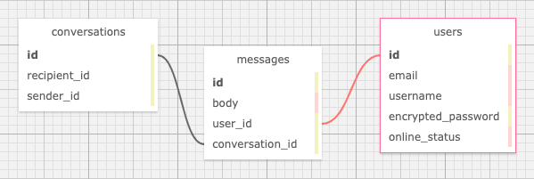

# _screenAIM_
An application meant to capture the essence and nostalgia that was AIM.

### Prime Team: _**Jo Miller, Andy Lawson, Zack Rutledge**_

[Epicodus](https://www.epicodus.com/) - [Ruby and Rails](https://www.learnhowtoprogram.com/ruby-and-rails/) - [Team Week](https://www.learnhowtoprogram.com/ruby-and-rails/team-week)

#### Date created: 04/05/2021 - 04/08/2021
---

## Technologies Used

* _Ruby 2.6.5_
* _Rails 5.2.5_
* _ActionCable 5.2.5_
* _Embedded Ruby (ERB)_
* _JavaScript_
* _pg 1.2.3_
* _jQuery Rails 4.4.0_
* _jQuery UI 6.0.1_
* _Pry 0.14.0_
* _Byebug 11.1.3_
* _PostgreSQL 13.2_
* _Bundler 2.2.11_
* _Puma 5.2.2_
* _Bootstrap-Sass 3.4.1_
* _git 2.30.0_

---

## Description

It's 3:30pm. You've just sat down in the 'computer room' with a pack of gushers and an ice cold Capri Sun. Your mom just got off the phone so it's time to fire up the dial-up.
You enter your password, click 'sign on', and that magical tone takes you back to when friends were more than just friends; they were Buddies. Enjoy this little trip down memory lane while you chat like it's the year 2000. TTYL!!

## Database Schema
The database for this application has the following tables and relationships:

---

## Requirements

* You will need to use your system's **terminal emulator** to setup and locally use this application.
* You must have **Ruby 2.6.5** installed to be able to launch this application ([how to install Ruby 2.6.5](https://www.learnhowtoprogram.com/ruby-and-rails/getting-started-with-ruby/installing-ruby)).
* **PostgreSQL** is required to manage this application's database. You can [follow this link](https://www.enterprisedb.com/downloads/postgresql) to install it.

---

## Setup/Installation

* To clone this directory, navigate in your terminal to the desired location of the project and run command `git clone https://github.com/joanna-miller/{repository_name}.git`
* Navigate to top level of the directory with command `cd {repository_name}`
* To install bundler for managing gems run command `gem install bundler`
* To install gems into the project run command `bundle install`
* Launch PostgreSQL to run a persistent database management server with command `postgres`
* To recreate database, run command `rake db:setup`
* To run tests using rspec, run command `rspec`
* To run a live server, from the root level of the project directory in your terminal, run command `rails server`
* To interact with application, navigate to http://localhost:3000/ in a web browser.
* Exit live server, press Ctrl+C in your terminal

---

## Editing Instructions

* To use Visual Studio Code to edit this project, follow install instructions [here](https://code.visualstudio.com/).
* To enable command `code`, open VS Code, click on View > Command Palette, type in "shell command", and click on "Shell Command: Install 'code' command in PATH"
* Now, from your terminal, in the project's top level directory, you can run command `code .` to open project in VS Code.

---

## Known Bugs

* Messages do not send by pressing enter key
* Chat windows do not reload on page refresh

---

## License

[MIT](LICENSE.txt)

---

## Contact Information

* _Contact Jo via [Email](mailto:joannadawnmiller@gmail.com) or [LinkedIn](https://www.linkedin.com/in/jomillerde/), or check out her [Github](https://github.com/joanna-miller)._

* _Contact Andy via [Email](mailto:alawson89@gmail.com) or [LinkedIn](https://www.linkedin.com/in/andrew-lawson-dev/), or check out his [Github](https://github.com/andyL89)._

* _Contact Zack via [Email](mailto:thorgrim88@gmail.com) or [LinkedIn](https://www.linkedin.com/in/zack-rutledge762/), or check out his [Github](https://github.com/dethik)._
